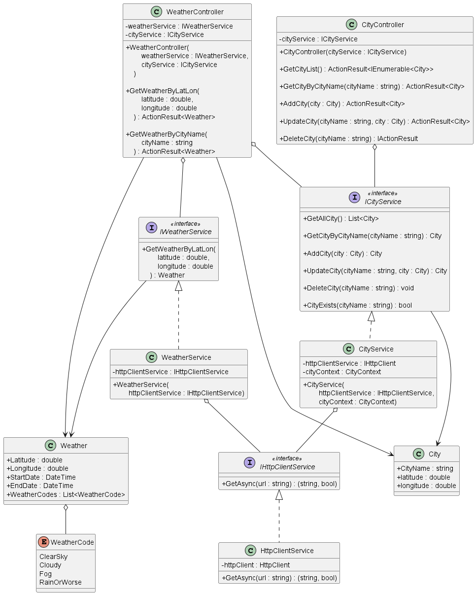

# weather-api

This is a C# solution to the Weather API.

The Base URL is `https://localhost:7230/`

The API has the following endpoints:

| Action  | Endpoint                                | What it does                                                                    | API Documentation |
| ------- | --------------------------------------- | ------------------------------------------------------------------------------- | ----------------- |
| **GET** | `api/v1/weather/{cityName}`             | **Get** today's weather for city: `{cityName}`                                  | [Click Here](#)   |
| **GET** | `api/v1/weather/{latitude}/{longitude}` | **Get** today's weather for geo coordinates near `{latitude}` and `{longitude}` | [Click Here](#)   |

Here we have 3 folders:

1. The `WeatherAPI` folder contains the C# solution to the challenge
2. The `WeatherAPI.Tests` folder contains the unit tests for the solution
3. The `diagrams` folder contains diagrams related to the solution

# Instructions

**Prerequisite**: The machine running the application should have [.NET 6.0](https://dotnet.microsoft.com/en-us/download/dotnet/6.0) (or above), and [MySQL](https://www.mysql.com/) installed.

...

# UML Diagram



# API Documentation

## `Weather` endpoints

## `City` endpoints

### Get City By City Name

[[Back To Top]](#weather-api)

### Request

**GET** `api/v1/city/{cityName}`

For Example `api/v1/city/Manchester`

### Response samples

Status Code: `200 OK`

Content type: `application/json`

```json
{
  "id": 1,
  "name": "Manchester",
  "latitude": 53.48095,
  "longitude": -2.23743
}
```

If `{cityName}` does not match any city name known by the API, then the response status code would be `404 Not Found`, with response body:

```
No geocoding found for Manchestersss, please do POST request to /api/v1/city endpoint to add new city.
```
